# Практика 4. Прикладной уровень

## Программирование сокетов: Прокси-сервер
Разработайте прокси-сервер для проксирования веб-страниц. 
Приложите скрины, демонстрирующие работу прокси-сервера. 

### Запуск прокси-сервера
Запустите свой прокси-сервер из командной строки, а затем запросите веб-страницу с помощью
вашего браузера. Направьте запросы на прокси-сервер, используя свой IP-адрес и номер порта.
Например, http://localhost:8888/www.google.com

_(*) Вы должны заменить стоящий здесь 8888 на номер порта в серверном коде, 
то есть тот, на котором прокси-сервер слушает запросы._

Вы можете также настроить непосредственно веб-браузер на использование вашего прокси сервера. 
В настройках браузера вам нужно будет указать адрес прокси-сервера и номер порта,
который вы использовали при запуске прокси-сервера (опционально).

### А. Прокси-сервер без кеширования (4 балла)
1. Разработайте свой прокси-сервер для проксирования http GET запросов от клиента веб-серверу 
   с журналированием проксируемых HTTP-запросов. В файле журнала сохраняется
   краткая информация о проксируемых запросах (URL и код ответа). Кеширование в этом
   задании не требуется. **(2 балла)**
2. Добавьте в ваш прокси-сервер обработку ошибок. Отсутствие обработчика ошибок может
   вызвать проблемы. Особенно, когда клиент запрашивает объект, который не доступен, так
   как ответ 404 Not Found, как правило, не имеет тела, а прокси-сервер предполагает, что
   тело есть и пытается прочитать его. **(1 балл)**
3. Простой прокси-сервер поддерживает только метод GET протокола HTTP. Добавьте
   поддержку метода POST. В запросах теперь будет использоваться также тело запроса
   (body). Для вызова POST запросов вы можете использовать Postman. **(1 балл)**

Приложите скрины или логи работы сервера.

#### Демонстрация работы
Логи:
- 2026-04-20 03:41:09,000 Proxy server is listening on port 12000...
- 2026-04-20 03:41:16,687 Received connection from ('127.0.0.1', 54548)
- 2026-04-20 03:41:16,688 Received connection from ('127.0.0.1', 54550)
- 2026-04-20 03:41:16,688 Received GET request for /www.google.com
- 2026-04-20 03:41:16,715 Status: b'HTTP/1.1 302 Found'
- 2026-04-20 03:41:16,939 Received connection from ('127.0.0.1', 54556)
- 2026-04-20 03:41:18,626 Received GET request for /www.google.com/rtf
- 2026-04-20 03:41:18,747 Status: b'HTTP/1.1 404 Not Found'
- 2026-04-20 03:41:21,949 Received connection from ('127.0.0.1', 43484)
- 2026-04-20 03:41:21,950 Received POST request for http://httpbin.org/post
- 2026-04-20 03:41:22,280 Status: b'HTTP/1.1 200 OK'
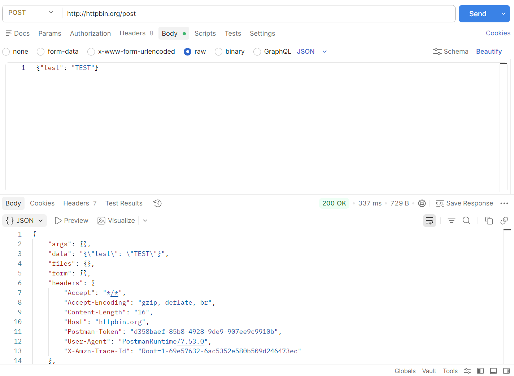

### Б. Прокси-сервер с кешированием (4 балла)
Когда прокси-сервер получает запрос, он проверяет, есть ли запрашиваемый объект в кэше, и,
если да, то возвращает объект из кэша без соединения с веб-сервером. Если объекта в кэше нет,
прокси-сервер извлекает его с веб-сервера обычным GET запросом, возвращает клиенту и
кэширует копию для будущих запросов.

Для проверки того, прокис объект в кеше или нет, необходимо использовать условный GET
запрос. В таком случае вам необходимо указывать в заголовке запроса значение для If-Modified-Since и If-None-Match. 
Подробности можно найти [тут](https://ruturajv.wordpress.com/2005/12/27/conditional-get-request).

Будем считать, что кеш-память прокси-сервера хранится на его жестком диске. Ваш прокси-сервер
должен уметь записывать ответы в кеш и извлекать данные из кеша (т.е. с диска) в случае
попадания в кэш при запросе. Для этого необходимо реализовать некоторую внутреннюю
структуру данных, чтобы отслеживать, какие объекты закешированы.

Приложите скрины или логи, из которых понятно, что ответ на повторный запрос был взят из кэша.

#### Демонстрация работы
Логи:
- 2026-04-20 18:56:57,951 Proxy server is listening on port 12000...
- 2026-04-20 18:57:03,982 Received connection from ('127.0.0.1', 47994)
- 2026-04-20 18:57:03,983 Received connection from ('127.0.0.1', 48010)
- 2026-04-20 18:57:03,983 Received GET request for /httpbin.org/cache
- 2026-04-20 18:57:03,984 Cache miss for /httpbin.org/cache
- 2026-04-20 18:57:04,236 Received connection from ('127.0.0.1', 48016)
- 2026-04-20 18:57:04,379 Status: b'HTTP/1.1 200 OK'
- 2026-04-20 18:57:04,379 Resource not in cache, loading from response
- 2026-04-20 18:57:05,740 Received GET request for /httpbin.org/cache
- 2026-04-20 18:57:05,740 Cache hit for /httpbin.org/cache
- 2026-04-20 18:57:06,353 Status: b'HTTP/1.1 304 NOT MODIFIED'
- 2026-04-20 18:57:06,354 Resource not modified, loading from cache

Кэш:
- {"/httpbin.org/cache": {"etag": "d2f8b5beabeb45619ff8d7918cb42dc7", "last-modified": "Mon, 20 Apr 2026 15:57:04 GMT"}}

### В. Черный список (2 балла)
Прокси-сервер отслеживает страницы и не пускает на те, которые попадают в черный список. Вместо
этого прокси-сервер отправляет предупреждение, что страница заблокирована. Список доменов
и/или URL-адресов для блокировки по черному списку задается в **конфигурационном файле**.

Приложите скрины или логи запроса из черного списка.

#### Демонстрация работы
Логи:
- 2026-04-20 19:13:36,980 Proxy server is listening on port 12000...
- 2026-04-20 19:13:57,873 Received connection from ('127.0.0.1', 59344)
- 2026-04-20 19:13:57,874 Received connection from ('127.0.0.1', 59354)
- 2026-04-20 19:13:57,874 Received GET request for /httpbin.org/bytes/100
- 2026-04-20 19:13:57,874 Blocked request for /httpbin.org/bytes/100
- 2026-04-20 19:13:58,128 Received connection from ('127.0.0.1', 59364)
- 2026-04-20 19:14:15,386 Received GET request for /www.google.com
- 2026-04-20 19:14:15,387 Blocked request for /www.google.com
- 2026-04-20 19:14:25,725 Received GET request for /httpbin.org/cache
- 2026-04-20 19:14:25,726 Cache miss for /httpbin.org/cache
- 2026-04-20 19:14:26,035 Received connection from ('127.0.0.1', 39114)
- 2026-04-20 19:14:26,205 Status: b'HTTP/1.1 200 OK'
- 2026-04-20 19:14:26,205 Resource not in cache, loading from response
- 2026-04-20 19:15:14,907 Received GET request for /httpbin.org/cache
- 2026-04-20 19:15:14,908 Cache hit for /httpbin.org/cache
- 2026-04-20 19:15:15,208 Received connection from ('127.0.0.1', 52736)
- 2026-04-20 19:15:15,374 Status: b'HTTP/1.1 304 NOT MODIFIED'
- 2026-04-20 19:15:15,375 Resource not modified, loading from cache

Конфиг лежит в config.py.

## Wireshark. Работа с DNS
Для каждого задания в этой секции приложите скрин с подтверждением ваших ответов.

### А. Утилита nslookup (1 балл)

#### Вопросы
1. Выполните nslookup, чтобы получить IP-адрес какого-либо веб-сервера в Азии
   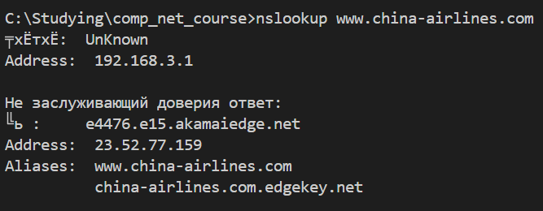
2. Выполните nslookup, чтобы определить авторитетные DNS-серверы для какого-либо университета в Европе
   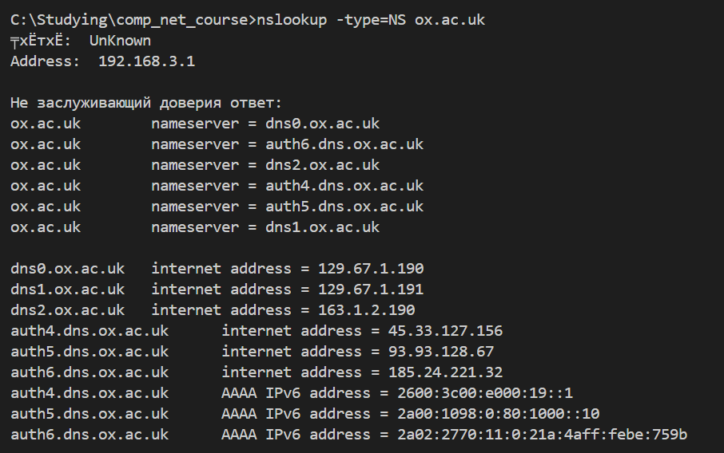
3. Используя nslookup, найдите веб-сервер, имеющий несколько IP-адресов. Сколько IP-адресов имеет веб-сервер вашего учебного заведения?
   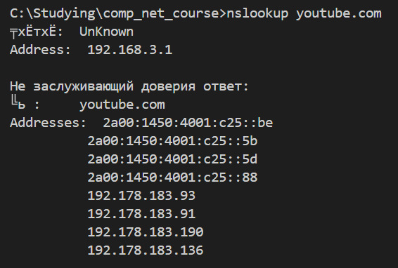
   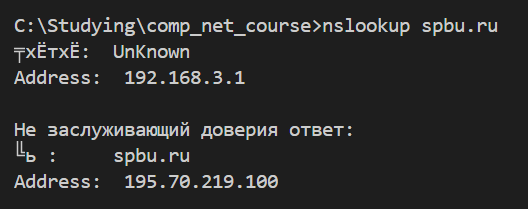
   - 1 адрес

### Б. DNS-трассировка www.ietf.org (3 балла)

#### Подготовка
1. Используйте ipconfig для очистки кэша DNS на вашем компьютере.
2. Откройте браузер и очистите его кэш (для Chrome можете использовать сочетание клавиш
   CTRL+Shift+Del).
3. Запустите Wireshark и введите `ip.addr == ваш_IP_адрес` в строке фильтра, где значение
   ваш_IP_адрес вы можете получить, используя утилиту ipconfig. Данный фильтр позволит
   нам отбросить все пакеты, не относящиеся к вашему хосту. Запустите процесс захвата пакетов в Wireshark.
4. Зайдите на страницу www.ietf.org в браузере.
5. Остановите захват пакетов.

#### Вопросы
1. Найдите DNS-запрос и ответ на него. С использованием какого транспортного протокола
   они отправлены?
   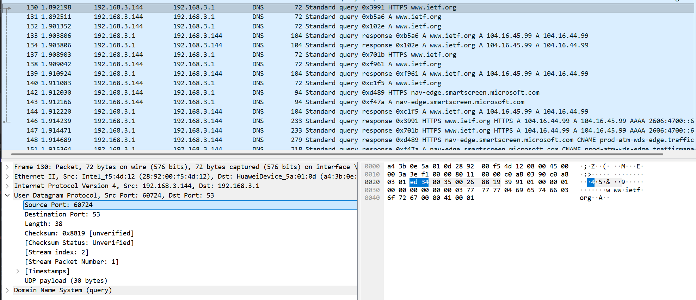
   - UDP
2. Какой порт назначения у запроса DNS?
   - На том же скрине видно, что порт назначения 53
3. На какой IP-адрес отправлен DNS-запрос? Используйте ipconfig для определения IP-адреса
   вашего локального DNS-сервера. Одинаковы ли эти два адреса?
   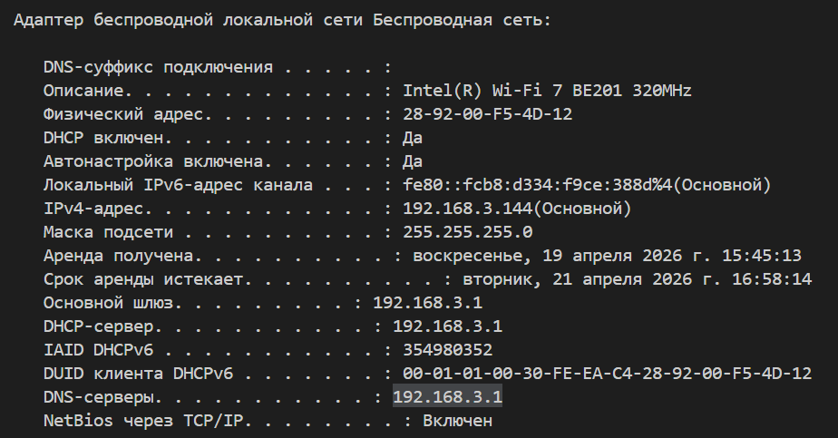
   - DNS запрос отправлен на 192.168.3.1, в ipconfig такой же
4. Проанализируйте сообщение-запрос DNS. Запись какого типа запрашивается? Содержатся
   ли в запросе какие-нибудь «ответы»?
   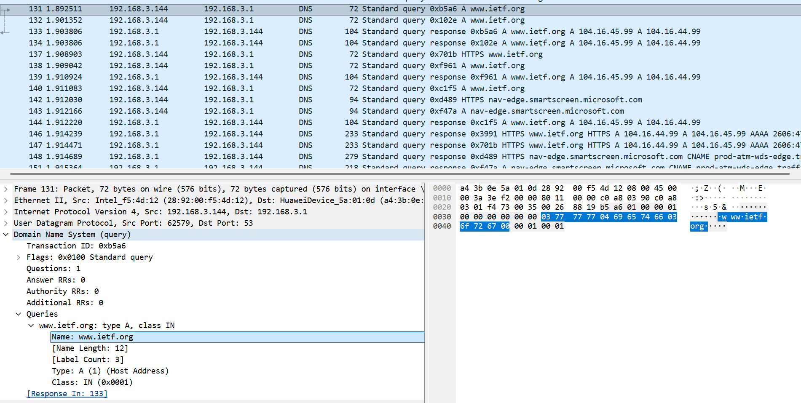
   - Тип A
   - Ответы не содержатся
5. Проанализируйте ответное сообщение DNS. Сколько в нем «ответов»? Что содержится в
   каждом?
   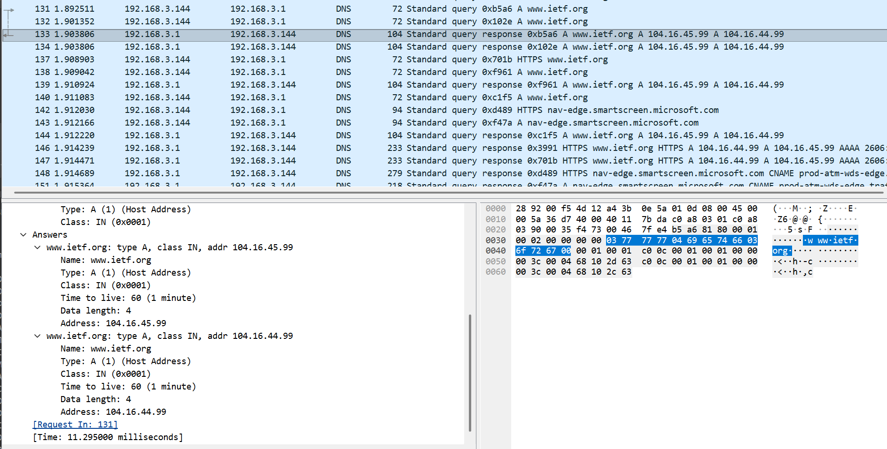
   - Два ответа
   - В каждом: имя, тип, класс, время жизни в кэше, длина в байтах, адрес. Адреса немного разные, видимо для балансировки нагрузки
6. Посмотрите на последующий TCP-пакет с флагом SYN, отправленный вашим компьютером.
   Соответствует ли IP-адрес назначения пакета с SYN одному из адресов, приведенных в
   ответном сообщении DNS?
   
   - Да, соответствует первому
7. Веб-страница содержит изображения. Выполняет ли хост новые запросы DNS перед
   загрузкой этих изображений?
   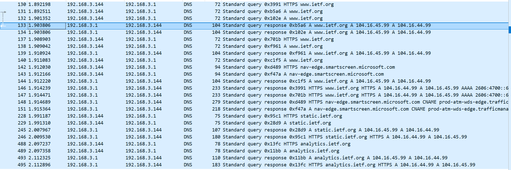
   - Да, браузер загружает изображения после резолвинга имени поддоменов

### В. DNS-трассировка www.spbu.ru (2 балла)

#### Подготовка
1. Запустите захват пакетов с тем же фильтром `ip.addr == ваш_IP_адрес`
2. Выполните команду nslookup для сервера www.spbu.ru
3. Остановите захват
4. Вы увидите несколько пар запрос-ответ DNS. Найдите последнюю пару, все вопросы будут относиться к ней
   
#### Вопросы
1. Каков порт назначения в запросе DNS? Какой порт источника в DNS-ответе?
   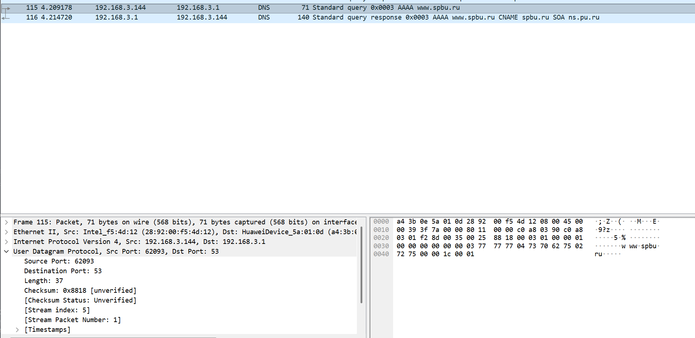
   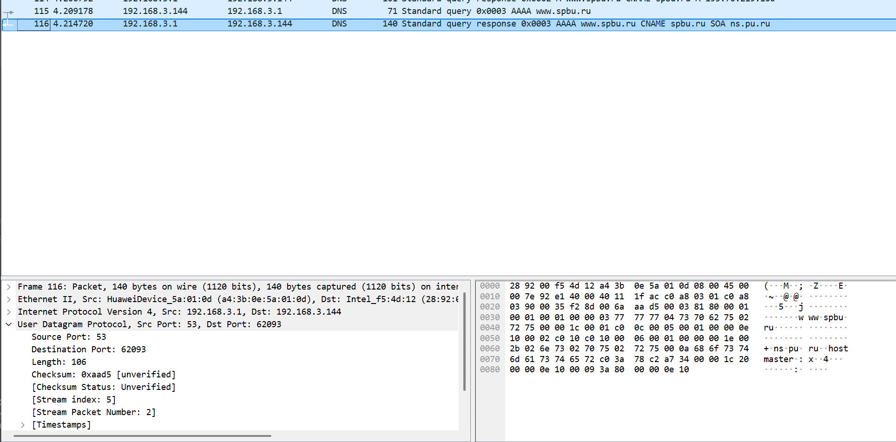
   - 53
   - 53
2. На какой IP-адрес отправлен DNS-запрос? Совпадает ли он с адресом локального DNS-сервера, установленного по умолчанию?
   - На 192.168.3.1	
   - Совпадает
3. Проанализируйте сообщение-запрос DNS. Запись какого типа запрашивается? Содержатся
   ли в запросе какие-нибудь «ответы»?
   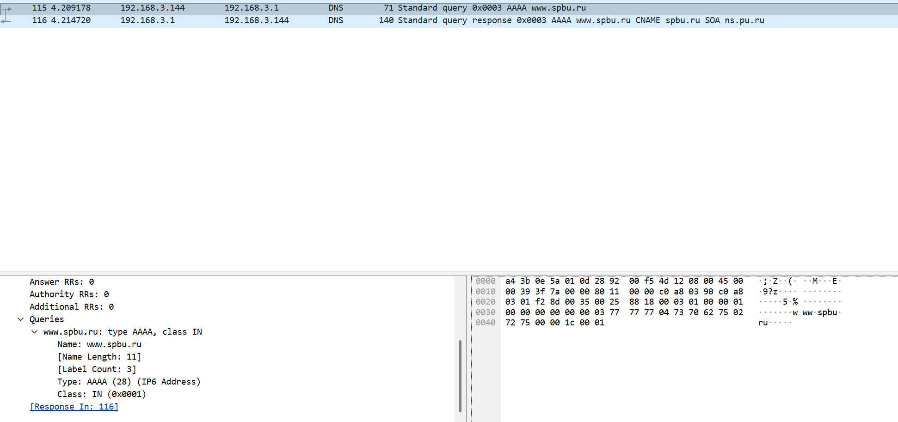
   - Запись типа AAAA
   - Ответов нету
4. Проанализируйте ответное сообщение DNS. Сколько в нем «ответов»? Что содержится в каждом?
   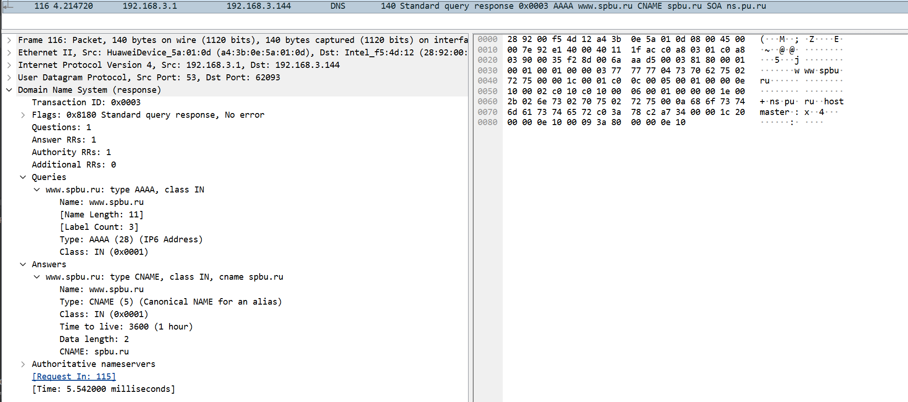
   - Один ответ
   - имя, класс, сколько времени на кэширование, длина в байтах, каноническое имя

### Г. DNS-трассировка nslookup –type=NS (1 балл)
Повторите все шаги по предварительной подготовке из Задания B, но теперь для команды `nslookup –type=NS spbu.ru`

#### Вопросы
1. На какой IP-адрес отправлен DNS-запрос? Совпадает ли он с адресом локального DNS-сервера, установленного по умолчанию?
   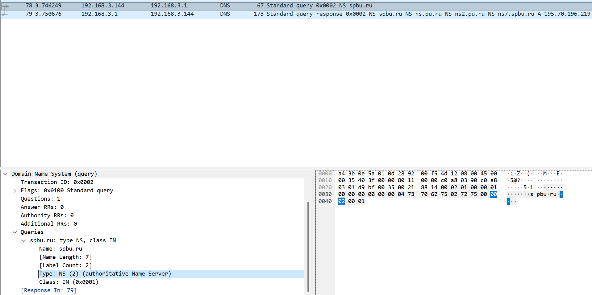
   - 192.168.3.1
   - Совпадает
2. Проанализируйте сообщение-запрос DNS. Запись какого типа запрашивается? Содержатся ли в запросе какие-нибудь «ответы»?
   - Тип NS
   - Нет
3. Проанализируйте ответное сообщение DNS. Имена каких DNS-серверов университета в
   нем содержатся? А есть ли их адреса в этом ответе?
   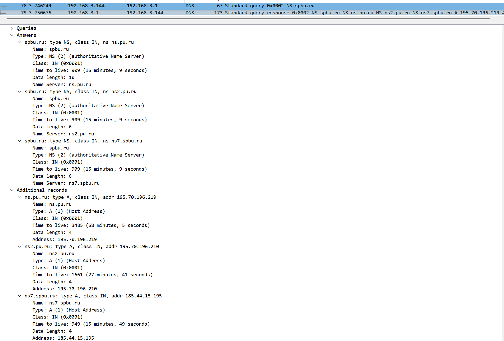
   - ns.pu.ru, ns2.pu.ru, ns7.spbu.ru
   - Есть, в разделе Additional records

### Д. DNS-трассировка nslookup www.spbu.ru ns2.pu.ru (1 балл)
Снова повторите все шаги по предварительной подготовке из Задания B, но теперь для команды `nslookup www.spbu.ru ns2.pu.ru`.
Запись `nslookup host_name dns_server` означает, что запрос на разрешение доменного имени `host_name` пойдёт к `dns_server`.
Если параметр `dns_server` не задан, то запрос идёт к DNS-серверу по умолчанию (например, к локальному).

#### Вопросы
1. На какой IP-адрес отправлен DNS-запрос? Совпадает ли он с адресом локального DNS-сервера, установленного по умолчанию? 
   Если нет, то какому хосту он принадлежит?
   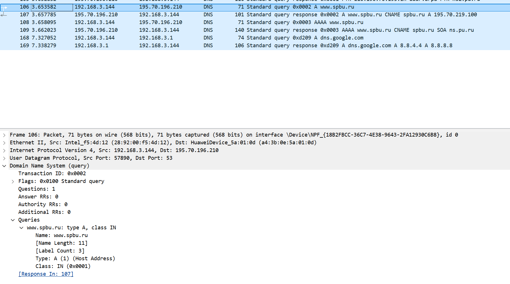
   - На 195.70.196.210
   - Нет, это адрес DNS сервера ns2.pu.ru (видно в терминале после выполнения nslookup)
2. Проанализируйте сообщение-запрос DNS. Запись какого типа запрашивается? Содержатся
   ли в запросе какие-нибудь «ответы»?
   - Тип A
   - Ответов не содержится
3. Проанализируйте ответное сообщение DNS. Сколько в нем «ответов»? Что содержится в
   каждом?
   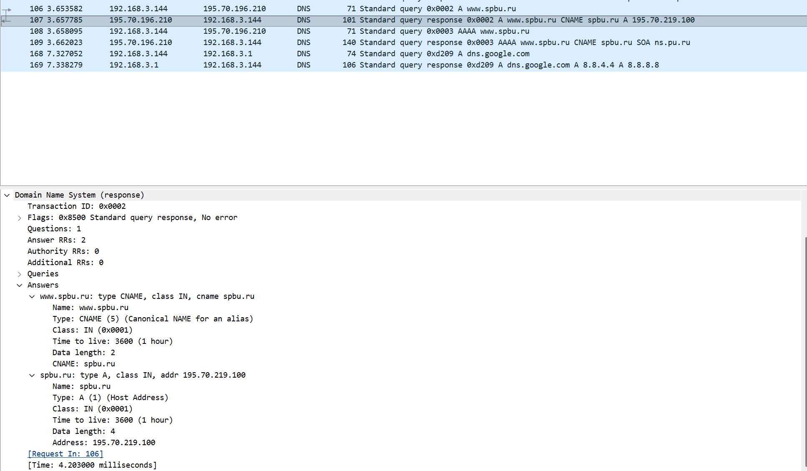
   - 2 ответа
   - Первый (CNAME): псевдоним spbu.ru, время жизни в кэше
   - Второй (A): IP-адрес spbu.ru, время жизни в кэше

### Е. Сервисы whois (2 балла)
1. Что такое база данных whois?
   - Это база данных, хранящая информацию о доменах: владельцах, DNS-серверах и т.д.
2. Используя различные сервисы whois в Интернете, получите имена любых двух DNS-серверов. 
   Какие сервисы вы при этом использовали?
   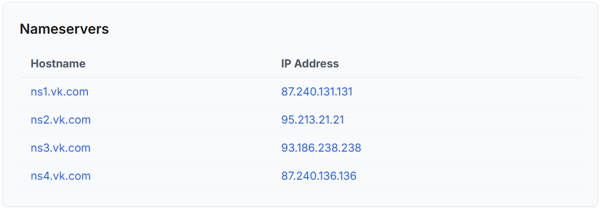
   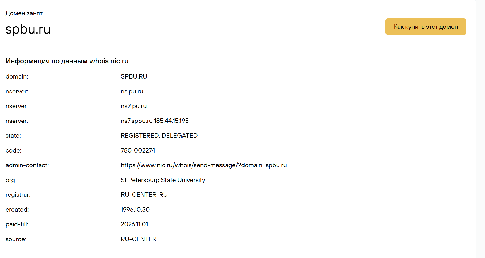
   - Я выбрал ns1.vk.com и ns.pu.ru 
   - Использовал who.is/whois и www.nic.ru/whois
3. Используйте команду nslookup на локальном хосте, чтобы послать запросы трем конкретным
   серверам DNS (по аналогии с Заданием Д): вашему локальному серверу DNS и двум DNS-серверам,
   найденным в предыдущей части.
   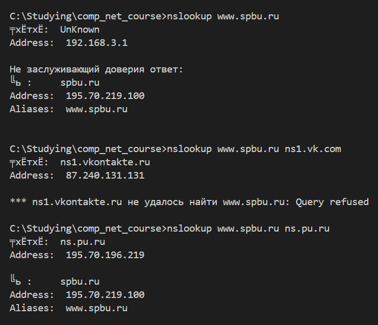
   - Вкшный сервер отказал в доступе, а локальный и спбгушный успешно вернули ответ
