# Практика 5. Прикладной уровень

## Программирование сокетов.

### A. Почта и SMTP (7 баллов)

### 1. Почтовый клиент (2 балла)
Напишите программу для отправки электронной почты получателю, адрес
которого задается параметром. Адрес отправителя может быть постоянным. Программа
должна поддерживать два формата сообщений: **txt** и **html**. Используйте готовые
библиотеки для работы с почтой, т.е. в этом задании **не** предполагается общение с smtp
сервером через сокеты напрямую.

Приложите скриншоты полученных сообщений (для обоих форматов).

#### Демонстрация работы
Я пытался использовать smtp сервер СПбГУ, но что-то не разобрался как залогиниться, по итогу нашел бесплатный сервис в интернете (mailtrap.io).
Вот демонстрация работы:
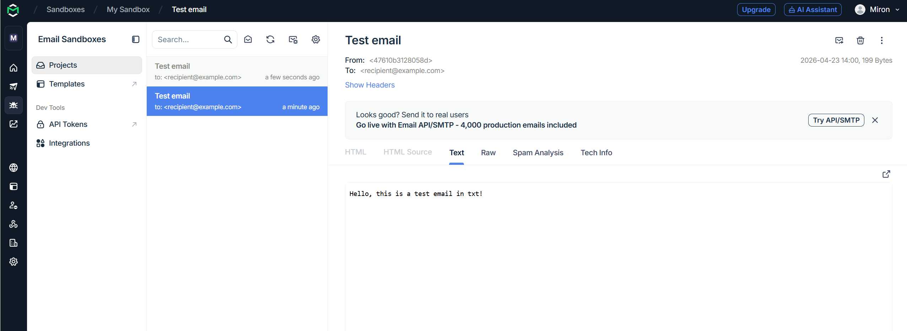
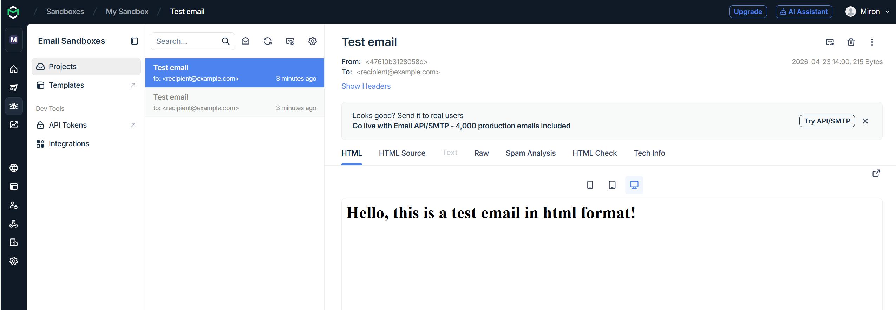

### 2. SMTP-клиент (3 балла)
Разработайте простой почтовый клиент, который отправляет текстовые сообщения
электронной почты произвольному получателю. Программа должна соединиться с
почтовым сервером, используя протокол SMTP, и передать ему сообщение.
Не используйте встроенные методы для отправки почты, которые есть в большинстве
современных платформ. Вместо этого реализуйте свое решение на сокетах с передачей
сообщений почтовому серверу.

Сделайте скриншоты полученных сообщений.

#### Демонстрация работы
логи:
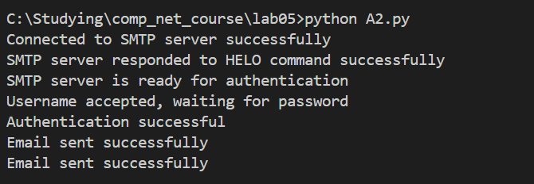
скриншоты:
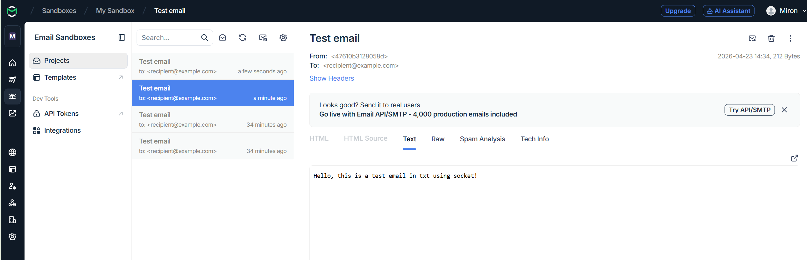
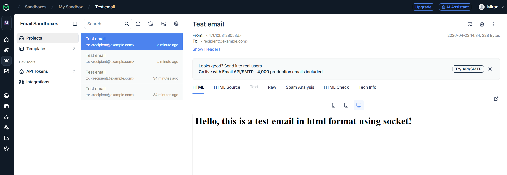

### 3. SMTP-клиент: бинарные данные (2 балла)
Модифицируйте ваш SMTP-клиент из предыдущего задания так, чтобы теперь он мог
отправлять письма с изображениями (бинарными данными).

Сделайте скриншот, подтверждающий получение почтового сообщения с картинкой.

#### Демонстрация работы

Картинка по итогу лежит в attachments, вот демонстрация:
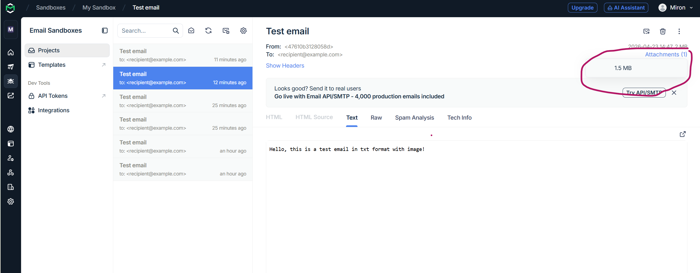

_Многие почтовые серверы используют ssl, что может вызвать трудности при работе с ними из
ваших приложений. Можете использовать для тестов smtp сервер СПбГУ: mail.spbu.ru, 25_

### Б. Удаленный запуск команд (3 балла)
Напишите программу для запуска команд (или приложений) на удаленном хосте с помощью TCP сокетов.

Например, вы можете с клиента дать команду серверу запустить приложение Калькулятор или
Paint (на стороне сервера). Или запустить консольное приложение/утилиту с указанными
параметрами. Однако запущенное приложение **должно** выводить какую-либо информацию на
консоль или передавать свой статус после запуска, который должен быть отправлен обратно
клиенту. Продемонстрируйте работу вашей программы, приложив скриншот.

Например, удаленно запускается команда `ping yandex.ru`. Результат этой команды (запущенной на
сервере) отправляется обратно клиенту.

#### Демонстрация работы
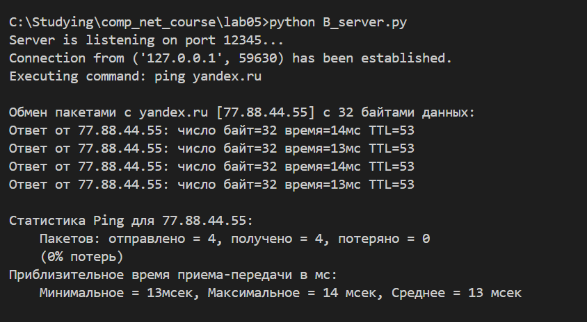
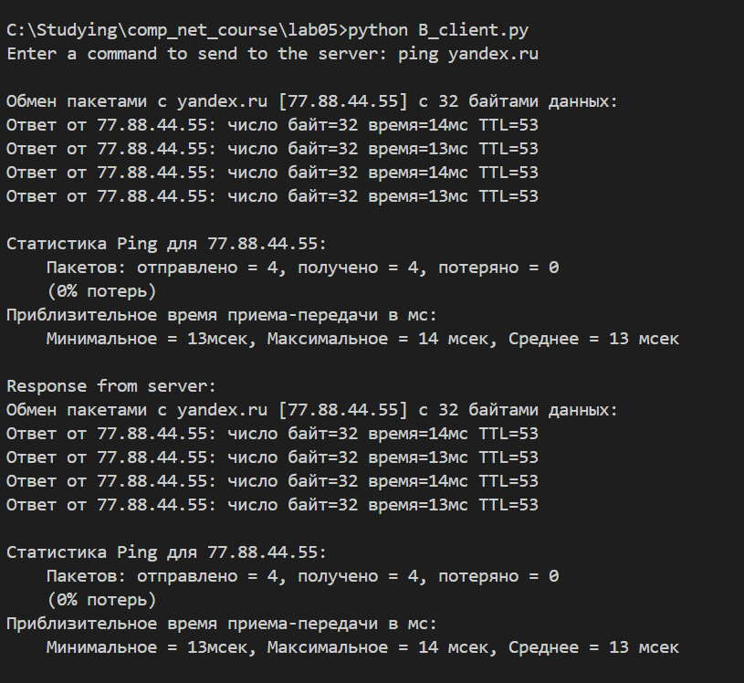

### В. Широковещательная рассылка через UDP (2 балла)
Реализуйте сервер (веб-службу) и клиента с использованием интерфейса Socket API, которая:
- работает по протоколу UDP
- каждую секунду рассылает широковещательно всем клиентам свое текущее время
- клиент службы выводит на консоль сообщаемое ему время

#### Демонстрация работы
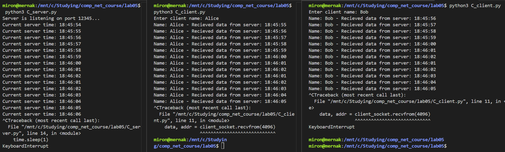

## Задачи

### Задача 1 (2 балла)
Рассмотрим короткую, $10$-метровую линию связи, по которой отправитель может передавать
данные со скоростью $150$ бит/с в обоих направлениях. Предположим, что пакеты, содержащие
данные, имеют размер $100000$ бит, а пакеты, содержащие только управляющую информацию
(например, флаг подтверждения или информацию рукопожатия) – $200$ бит. Предположим, что у
нас $10$ параллельных соединений, и каждому предоставлено $1/10$ полосы пропускания канала
связи. Также допустим, что используется протокол HTTP, и предположим, что каждый
загруженный объект имеет размер $100$ Кбит, и что исходный объект содержит $10$ ссылок на другие
объекты того же отправителя. Будем считать, что скорость распространения сигнала равна
скорости света ($300 \cdot 10^6$ м/с).
1. Вычислите общее время, необходимое для получения всех объектов при параллельных
непостоянных HTTP-соединениях
2. Вычислите общее время для постоянных HTTP-соединений. Ожидается ли существенное
преимущество по сравнению со случаем непостоянного соединения?

#### Решение
Посчитаем $RTT$ (считая что весь канал предоставлен одному соединению): он состоит из задержки распостранения и задержки передачи. Так как скорость передачи в обоих направления одинакова и равна 150 бит/c, то $d_{передачи} = \frac{200}{150} с = \frac{4}{3} с$. Задержка распостранения считается из длины канала и скорости распостранения сигнала, то есть $d_{распостранения} = \frac{10}{3 \cdot 10^8} с = \frac{1}{3 \cdot 10^7} с \approx 0$ с. Тогда получается, что 
\[
   RTT = 2 \cdot (d_{передачи} + d_{распостранения}) \approx \frac{8}{3} с.
\]
Тогда можно посчитать общее время: сначала скачается первый объект за 
\[ 
   2 \cdot RTT + d_{передачи} = \dfrac{16}{3} + \dfrac{100000}{150} с = \dfrac{2016}{3} с = 672 с.
\]
Осталось к этому времени прибавить время на скачку одного из оставшихся 10 объектов. Очевидно оно будет просто в 10 раз больше, так как задержка передачи будет в 10 раз больше и RTT будет в 10 раз больше (примерно, опять же можно игнорировать задержку распостранения). Так что итого $672 \cdot (1 + 10) = 7392$ с.

Теперь для постоянных соединений. Все что меняется - то, как мы загружаем объекты. Мы все еще загружаем первый объект за $2 \cdot RTT + d_{передачи}$, но все остальные объекты мы загружаем последовательно по $RTT + d_{передачи}$ на каждый. То есть в итоге будет 
\[
   12 \cdot RTT + 11 \cdot d_{передачи} = \frac{12 \cdot 8}{3} + 11 \cdot \frac{100000}{150} с = 32 + \frac{22000}{3} с \approx 7365 с.
\]
Время на загрузку всех файлов уменьшилось больше на примерно 30 секунд из 7000 (то есть меньше чем на полпроцента), это врядли можно назвать существенной разницей.

### Задача 2 (3 балла)
Рассмотрим раздачу файла размером $F = 15$ Гбит $N$ пирам. Сервер имеет скорость отдачи $u_s = 30$
Мбит/с, а каждый узел имеет скорость загрузки $d_i = 2$ Мбит/с и скорость отдачи $u$. Для $N = 10$, $100$
и $1000$ и для $u = 300$ Кбит/с, $700$ Кбит/с и $2$ Мбит/с подготовьте график минимального времени
раздачи для всех сочетаний $N$ и $u$ для вариантов клиент-серверной и одноранговой раздачи.

#### Решение
Я взял формулы с лекций для оценки минимального времени раздачи, построил графички в log-scale для наглядности (через matplotlib), вот что вышло (для N=10 синяя точка перекрывается оранжевой, ничего поделать с этим не вышло):
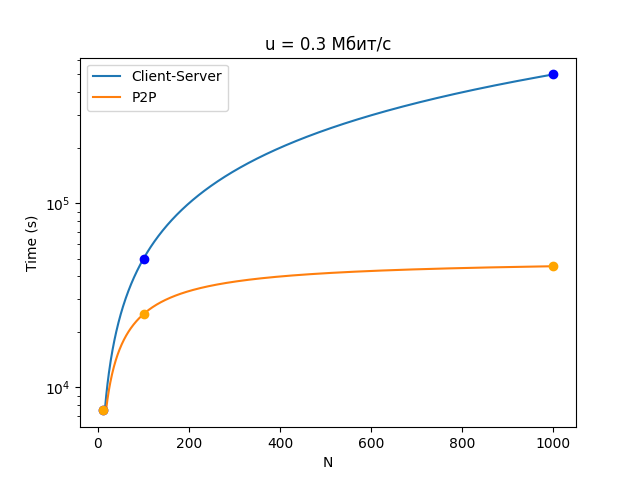
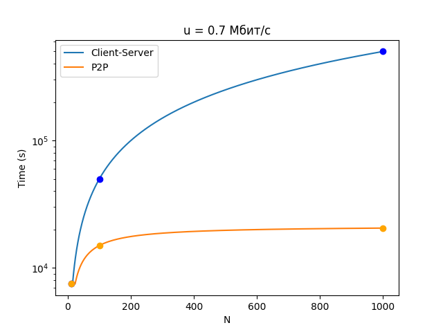
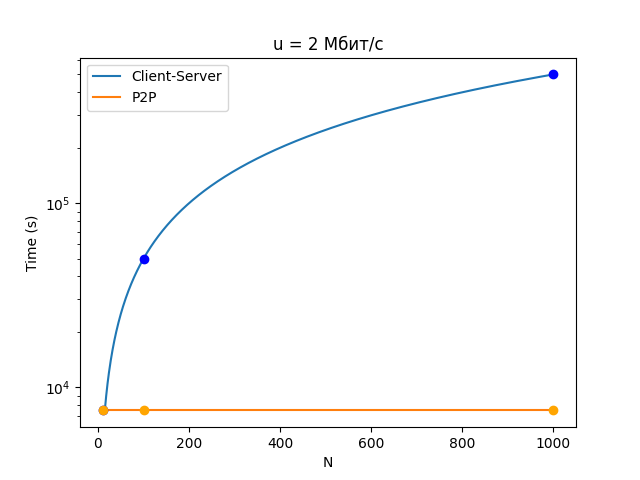

### Задача 3 (3 балла)
Рассмотрим клиент-серверную раздачу файла размером $F$ бит $N$ пирам, при которой сервер
способен отдавать одновременно данные множеству пиров – каждому с различной скоростью,
но общая скорость отдачи при этом не превышает значения $u_s$. Схема раздачи непрерывная.
1. Предположим, что $\dfrac{u_s}{N} \le d_{min}$.
   При какой схеме общее время раздачи будет составлять $\dfrac{N F}{u_s}$?
2. Предположим, что $\dfrac{u_s}{N} \ge d_{min}$. 
   При какой схеме общее время раздачи будет составлять  $\dfrac{F}{d_{min}}$?
3. Докажите, что минимальное время раздачи описывается формулой $\max\left(\dfrac{N F}{u_s}, \dfrac{F}{d_{min}}\right)$?

#### Решение
1. Пусть сервер отдает каждому пиру файл со скоростью $\dfrac{u_s}{N}$. Так как скорость загрузки у всех клиентов не меньше этой скорости отдачи по условию, каждый клиент будет успевать получить все отправленные данные, а значит общее время составит $\dfrac{F}{\frac{u_s}{N}} = \dfrac{N F}{u_s}$.

2. Можно использовать ту же схему раздачи, просто теперь клиент не будет успевать получить все данные сразу. Единственное ограничение, которое мы здесь имеем - скорость загрузки клиента, которая равна $d_{min}$, а значит файл полностью каждый клиент получит через $\dfrac{F}{d_{min}}$ времени.

3. Нам нужно лишь доказать, что время раздачи $\geq \max\left(\dfrac{N F}{u_s}, \dfrac{F}{d_{min}}\right)$, ведь примеры мы уже построили. Сервер должен отправить $N$ копий файла по $F$ бит (то есть суммарно $NF$ бит), скорость выгрузки $\leq u_s$, а значит потребуется $\geq \dfrac{N F}{u_s}$ времени. С другой стороны, каждый клиент должен принять файл размером $F$ бит, имея скорость загрузки $d$. Дольше всех будет принимать файл клиент с наименьшей скоростью загрузки $d_{min}$, а значит время раздачи $\geq \dfrac{F}{d_{min}}$, ч.т.д.
