# Практика 9. Сетевой уровень

## Wireshark: ICMP
В лабораторной работе предлагается исследовать ряд аспектов протокола ICMP:
- ICMP-сообщения, генерируемые программой Ping
- ICMP-сообщения, генерируемые программой Traceroute
- Формат и содержимое ICMP-сообщения

### 1. Ping (4 балла)
Программа Ping на исходном хосте посылает пакет на целевой IP-адрес; если хост с этим адресом
активен, то программа Ping на нем откликается, отсылая ответный пакет хосту, инициировавшему
связь. Оба этих пакета Ping передаются по протоколу ICMP.

Выберите какой-либо хост, расположенный на другом континенте (например, в Америке или
Азии). Захватите с помощью Wireshark ICMP пакеты от утилиты ping.
Для этого из командной строки запустите команду (аргумент `-n 10` означает, что должно быть
отослано 10 ping-сообщений): `ping –n 10 host_name`

Для анализа пакетов в Wireshark введите строку icmp в области фильтрации вывода.
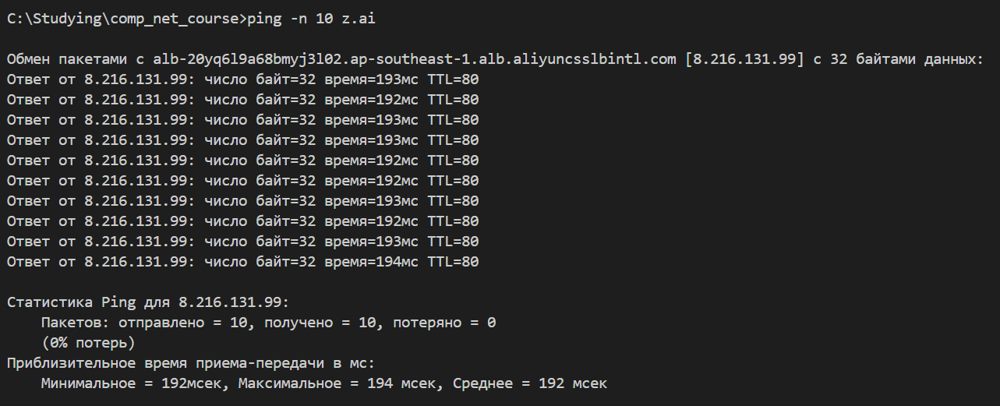

#### Вопросы
1. Каков IP-адрес вашего хоста? Каков IP-адрес хоста назначения?
   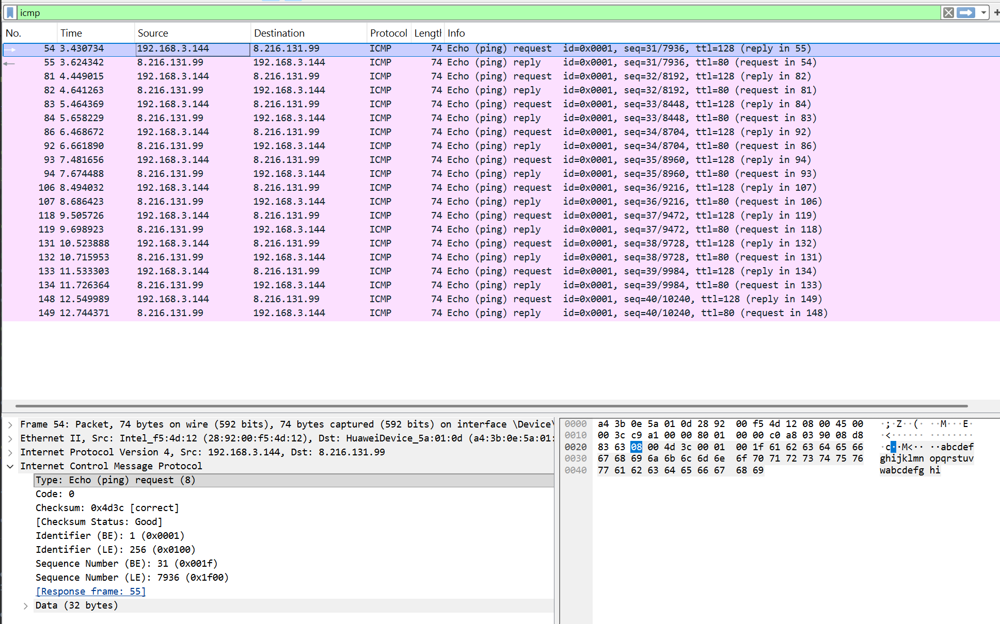
   - 192.168.3.144
   - 8.216.131.99
2. Почему ICMP-пакет не обладает номерами исходного и конечного портов?
   - ICMP работает на сетевом уровне, а значит портами (которые нужны на транспортном уровне) вовсе не оперирует
3. Рассмотрите один из ping-запросов, отправленных вашим хостом. Каковы ICMP-тип и кодовый
   номер этого пакета? Какие еще поля есть в этом ICMP-пакете? Сколько байт приходится на поля 
   контрольной суммы, порядкового номера и идентификатора?
   Все видно на картинке выше.
   - Тип 8 (то есть echo), код 0
   - Контрольная сумма, идентификатор, порядковый номер, данные
   - На каждое поле по 2 байта, данные состоят из 32 байт
4. Рассмотрите соответствующий ping-пакет, полученный в ответ на предыдущий. 
   Каковы ICMP-тип и кодовый номер этого пакета? Какие еще поля есть в этом ICMP-пакете? 
   Сколько байт приходится на поля контрольной суммы, порядкового номера и идентификатора?
   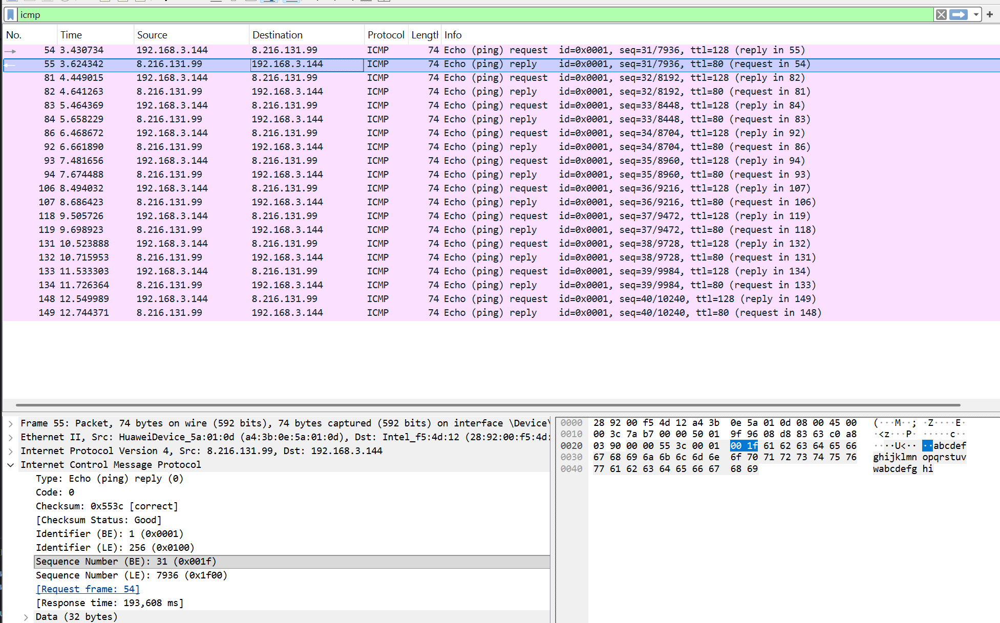
   - Тип 0 и код 0
   - Поля те же самые
   - Размеры полей те же

### 2. Traceroute (4 балла)
Программа Traceroute может применяться для определения пути, по которому пакет попал с
исходного на конечный хост.

Traceroute отсылает первый пакет со значением TTL = 1, второй – с TTL = 2 и т.д. Каждый
маршрутизатор понижает TTL-значение пакета, когда пакет проходит через этот маршрутизатор.
Когда на маршрутизатор приходит пакет со значением TTL = 1, этот маршрутизатор отправляет
обратно к источнику ICMP-пакет, свидетельствующий об ошибке.

Задача – захватить ICMP пакеты, инициированные программой traceroute, в сниффере Wireshark.
В ОС Windows вы можете запустить: `tracert host_name`

Выберите хост, который **расположен на другом континенте**.

#### Вопросы
1. Рассмотрите ICMP-пакет с эхо-запросом на вашем скриншоте. Отличается ли он от ICMP-пакетов
   с ping-запросами из Задания 1 (Ping)? Если да – то как?
   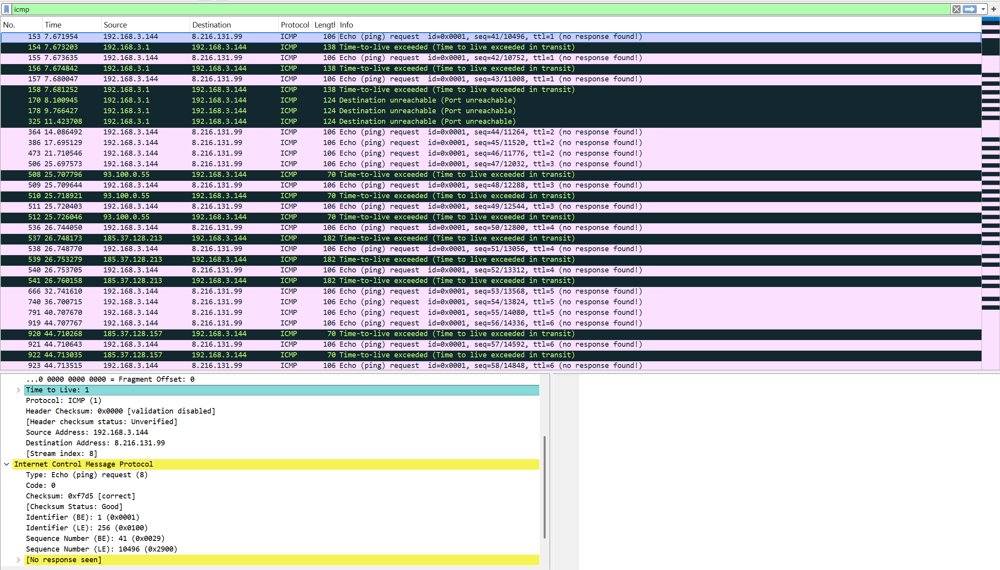
   - Да, TTL намеренно ставится маленьким и со временем увеличивается для того, чтобы получать ответ от маршутизаторов на пути к серверу. В ping TTL сразу ставится побольше для того, чтобы достучаться до сервера.
2. Рассмотрите на вашем скриншоте ICMP-пакет с сообщением об ошибке. В нем больше полей,
   чем в ICMP-пакете с эхо-запросом. Какая информация содержится в этих дополнительных полях?
   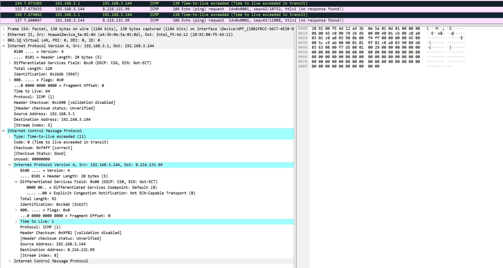
   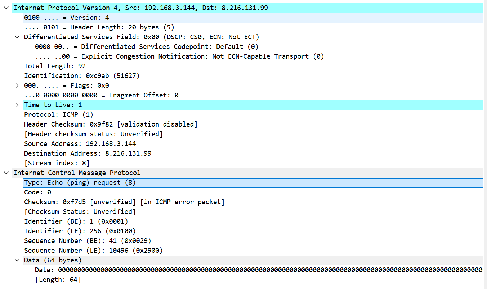
   - Мне пришел ICMP-пакет с типом 11 (то есть TTL стал равен 0 и произошла ошибка), а дополнительная поля просто содержат вложенный IP-заголовок request пакета и первые 8 байт оригинального пакета, в котором есть адрес клиента и сервера, TTL, идентификтор и порядковый номер.
3. Рассмотрите три последних ICMP-пакета, полученных исходным хостом. Чем эти пакеты
   отличаются от ICMP-пакетов, сообщающих об ошибках? Чем объясняются такие отличия?
   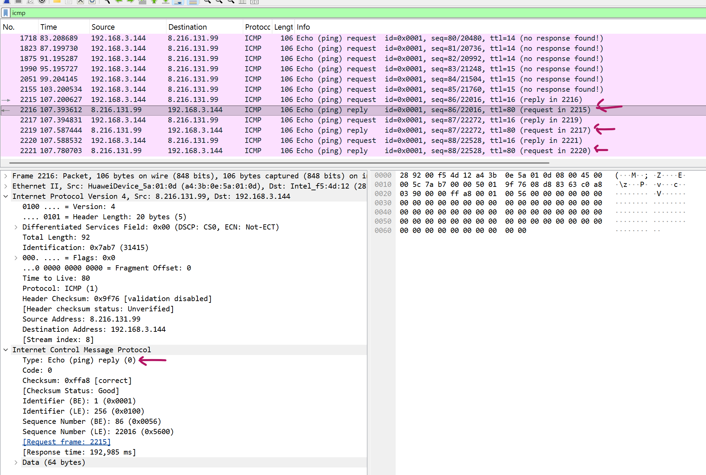
   - В этих пакетах тип меняется на 0 (echo reply), то есть пакет успешно дошел до сервера и сервер возвращает ответ об этом. Теперь source adress это действительно ip адрес сервера, который мы вбивали в traceroute (у меня z.ai). Также, в отличие от ICMP-пакета с типом 11, не возвращаются байты оригинального пакета, видимо потому что эти пакеты уже возвращаются с сервера, а значит их отбрасывать не нужно.
4. Есть ли такой канал, задержка в котором существенно превышает среднее значение? Можете
   ли вы, опираясь на имена маршрутизаторов, определить местоположение двух маршрутизаторов,
   расположенных на обоих концах этого канала?
   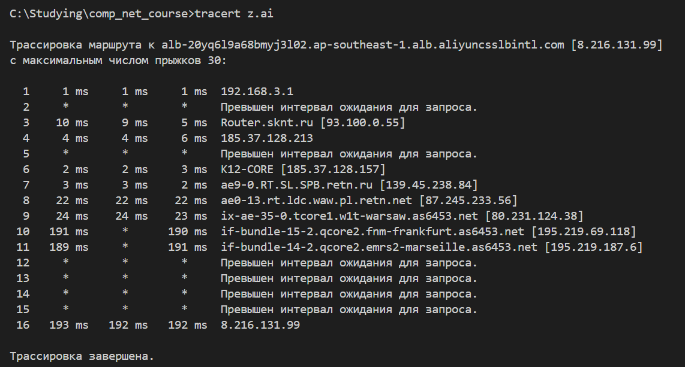
   - Да, явно есть скачок от 9 к 10 каналу. 
   - В данном случае очевидно да, просто в названии хоста есть имя города. Соотственно большой скачок происходит между Варшавой и Франкфуртом.

## Программирование.

### 1. IP-адрес и маска сети (1 балл)
Напишите консольное приложение, которое выведет IP-адрес вашего компьютера и маску сети на консоль.

#### Демонстрация работы
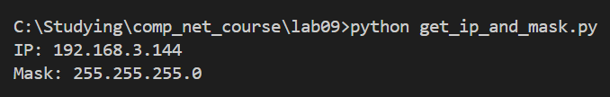

### 2. Доступные порты (2 балла)
Выведите все доступные (свободные) порты в указанном диапазоне для заданного IP-адреса. 
IP-адрес и диапазон портов должны передаваться в виде входных параметров.

#### Демонстрация работы
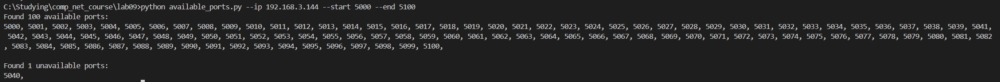

### 3. Широковещательная рассылка для подсчета копий приложения (6 баллов)
Разработать приложение, подсчитывающее количество копий себя, запущенных в локальной сети.
Приложение должно использовать набор сообщений, чтобы информировать другие приложения
о своем состоянии. После запуска приложение должно рассылать широковещательное сообщение
о том, что оно было запущено. Получив сообщение о запуске другого приложения, оно должно
сообщать этому приложению о том, что оно работает. Перед завершением работы приложение
должно информировать все известные приложения о том, что оно завершает работу. На экран
должен выводиться список IP адресов компьютеров (с указанием портов), на которых приложение
запущено.

Приложение считает другое приложение запущенным, если в течение промежутка времени,
равного нескольким интервалам между рассылками широковещательных сообщений, от него
пришло сообщение.

**Такое приложение может быть использовано, например, при наличии ограничения на
количество лицензионных копий программ.*

Пример GUI:

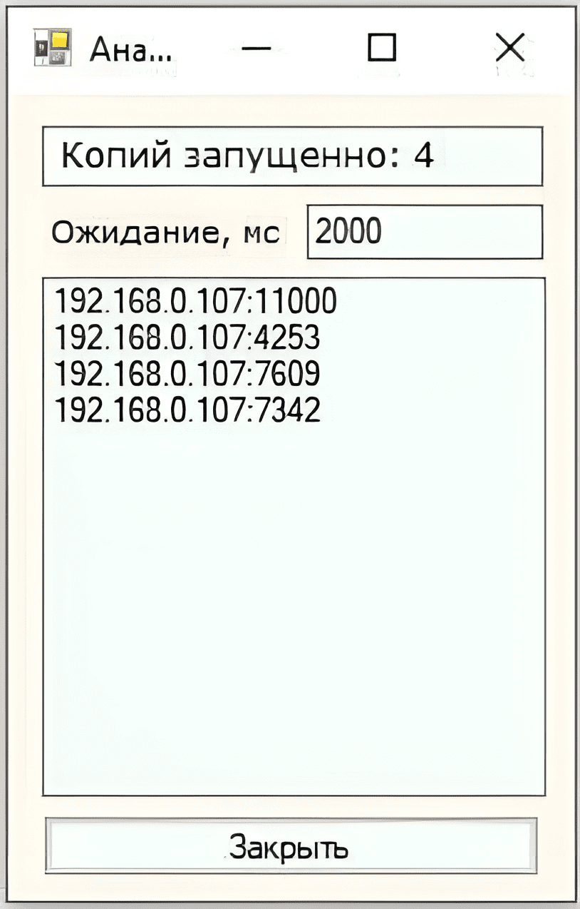

#### Демонстрация работы
до запуска третьей копии:
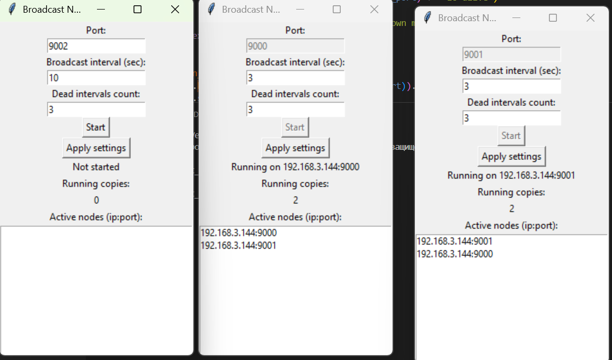
после запуска третьей копии спустя пару секунд:
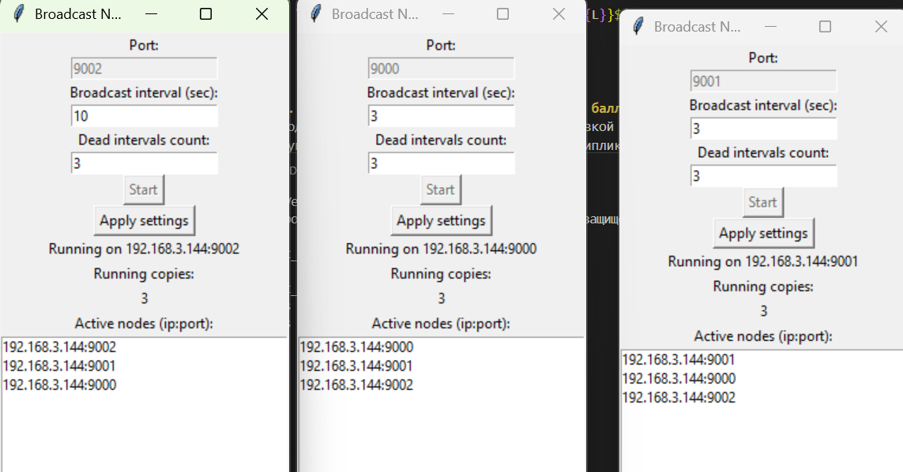
после ~10 секунд после запуска третьей копии (успел поймать момент когда одна из предыдущих копий обновила счетчик и для нее клиент умер так как 3*3 < 10, а у первой копии в этот момент счетчик обновился и она уже получила сообщение):
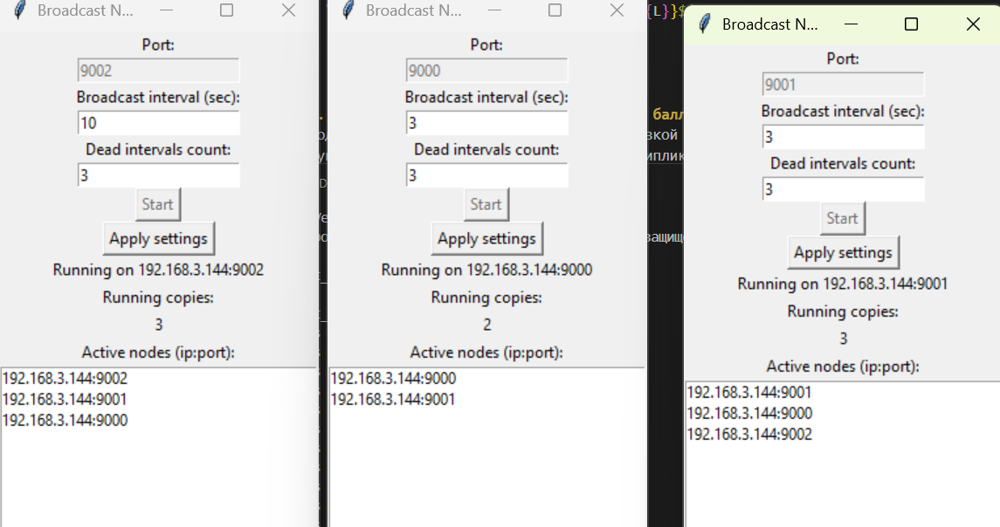
закрыл все копии кроме одной:
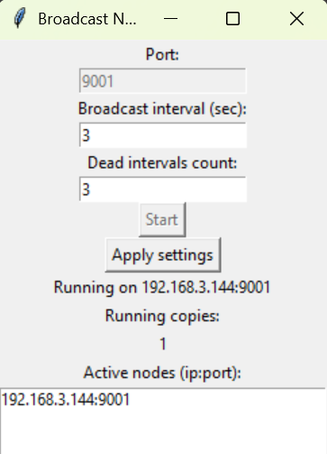
## Задачи. Работа протокола TCP

### Задача 1. Докажите формулы (3 балла)
Пусть за период времени, в который изменяется скорость соединения с $\frac{W}{2 \cdot RTT}$
до $\frac{W}{RTT}$, только один пакет был потерян (очень близко к концу периода).
1. Докажите, что частота потери $L$ (доля потерянных пакетов) равна
   $$L = \dfrac{1}{\frac{3}{8} W^2 + \frac{3}{4} W}$$
2. Используйте выше полученный результат, чтобы доказать, что, если частота потерь равна
   $L$, то средняя скорость приблизительно равна
   $$\approx \dfrac{1.22 \cdot MSS}{RTT \cdot \sqrt{L}}$$

#### Решение

1. За цикл окно растёт от $W/2$ до $W$ (плюс 1 к размеру за каждый RTT). Итого передано пакетов за цикл: $$N = \frac{W}{2} + \left(\frac{W}{2}+1\right) + \cdots + W = \frac{\left(\frac{W}{2}+W\right)\left(\frac{W}{2}+1\right)}{2} = \frac{3W^2}{8} + \frac{3W}{4}$$ Потерян ровно 1 пакет в цикле, поэтому:

$$L = \frac{1}{\dfrac{3}{8}W^2 + \dfrac{3}{4}W}.$$

2. Среднее окно за цикл имеет размер $\frac{3W}{4}$

Средняя пропускная способность:

$$\frac{3W}{4} \cdot \frac{MSS}{RTT}$$

Нужно показать, что $\dfrac{3W}{4} \approx \dfrac{1.22}{\sqrt{L}}$, то есть $L \approx \dfrac{1.22^2 \cdot 16}{9W^2}$.

Из части 1 так как $W^2 \gg W$:

$$L \approx \frac{8}{3W^2}$$

Осталось проверить: $\dfrac{1.22^2 \cdot 16}{9} = \dfrac{1.4884 \cdot 16}{9}  \approx 2.646 \approx \dfrac{8}{3} \approx 2.667$ — значения совпадают приближённо, ч.т.д.

### Задача 2. Найдите функциональную зависимость (3 балла)
Рассмотрим модификацию алгоритма управления перегрузкой протокола TCP. Вместо
аддитивного увеличения, мы можем использовать мультипликативное увеличение. 
TCP-отправитель увеличивает размер своего окна в небольшую положительную 
константу $a$ ($a > 1$), как только получает верный ACK-пакет.
1. Найдите функциональную зависимость между частотой потерь $L$ и максимальным
размером окна перегрузки $W$.
2. Докажите, что для этого измененного протокола TCP, независимо от средней пропускной
способности, TCP-соединение всегда требуется одинаковое количество времени для
увеличения размера окна перегрузки с $\frac{W}{2}$ до $W$.

#### Решение
Мне показалось логичным доказывать сначала 2, а потом 1, используя 2.

При мультипликативном увеличении окно растёт как $W/2,\ aW/2,\ a^2 W/2,\ \ldots$ Чтобы дойти от $W/2$ до $W$, нужно $k$ шагов:

$$\frac{W}{2} \cdot a^k = W \implies a^k = 2 \implies k = \log_a 2$$

Отсюда время роста от $W/2$ до $W$ всегда одинаково ($\log_a 2$ интервалов RTT) вне зависимости от средней пропускной способности.

Теперь 1:

За цикл передаётся геометрическая прогрессия пакетов:

$$N = \frac{W}{2} + \frac{aW}{2} + \frac{a^2 W}{2} + \cdots + \frac{a^{\log_a 2}\, W}{2} = \frac{W}{2} \cdot \frac{a^{\log_a 2 + 1} - 1}{a - 1}$$

Упростим:

$$N = \frac{W}{2} \cdot \frac{2a - 1}{a - 1} = \frac{W(2a-1)}{2(a-1)}$$

Потерян 1 пакет в цикле, поэтому:

$$L = \frac{1}{N} = \frac{2(a-1)}{W(2a-1)}$$.
